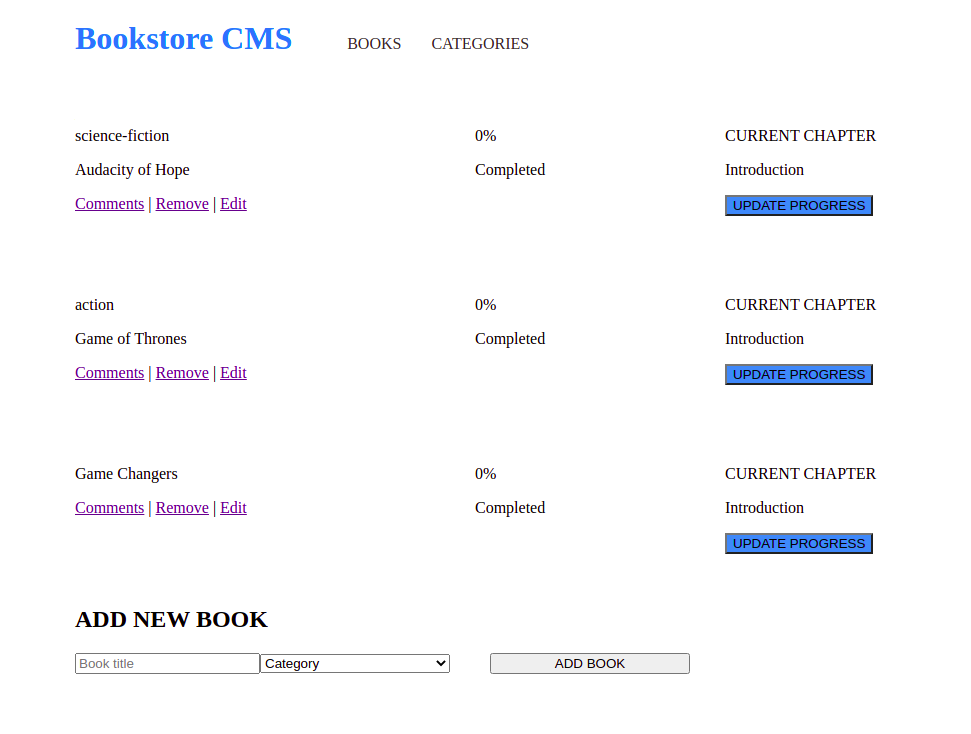

# Bookstore
In this project I have laid a foundation for your Bookstore website. I have created a React and Redux app. I have structured the files using the "feature folder" approach. I have also set up routing using React Router. The app enables you to display a list books, add a book, remove a selected book.

## Features:
- Displays the interface
- Add and Remove books

## Built With

- React
- CSS3
- Webpack
- Babel

## Live Demo
- Comming soon! 

## Getting Started
- Follow setup instructions below

### Prerequisites

- node.js
- Javascript
- Git and Github
- Terminal
- browser

### Setup

- clone the following repo link, git@github.com:git@github.com:Mihndim2020/Bookstore.git
- cd into the directory and run npm install to install dependencies
- run npm start

### Usage
- Run npm install on a Terminal to install the modules
- run npm start
- Open http://localhost:3000 to view it in the browser.

## Author

👤 **Mih Julius Ndim **

- Github: [@Mihndim2020](https://github.com/Mihndim2020)
- Twitter: [@mihndim](https://github.com/mih-julius) 
- Linkedin: [Mih Julius](https://www.linkedin.com/mih-julius)
